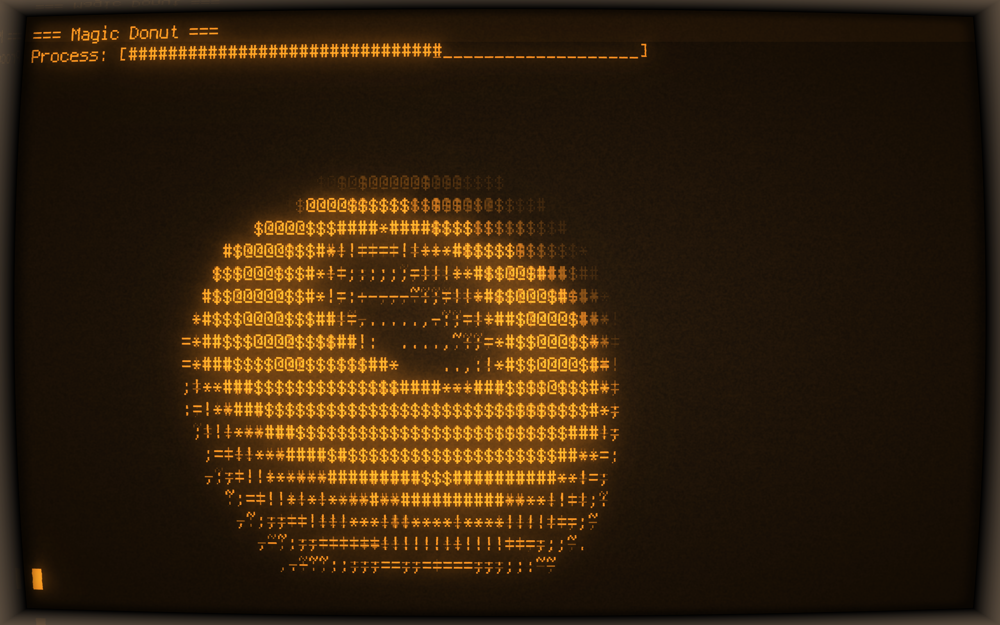
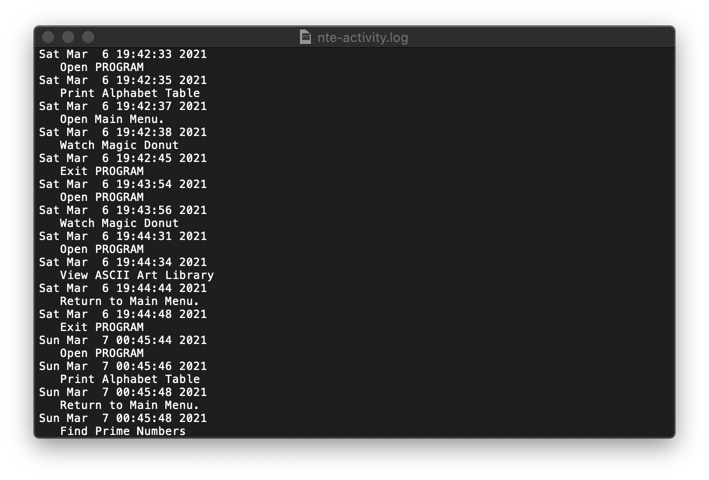

# Tuần 2: Chương trình tích hợp NothingToEverything (NTE)
Chương trình gồm các chức năng đơn giản: In bảng chữ cái, tìm số nguyên tố, tính ước chung lớn nhất, bội chung nhỏ nhất đến các chức năng nâng cao hơn như tranh ảnh bằng mã ASCII, vật 3d chuyển động.

Đồng thời chương trình cũng sinh ra file log để lưu lại lịch sử sử dụng.

Hiện tại chương trình có thể compile và chạy trên các nền tảng sau:
- Window
- Linux
- Unix-like OS (eg: MacOS)