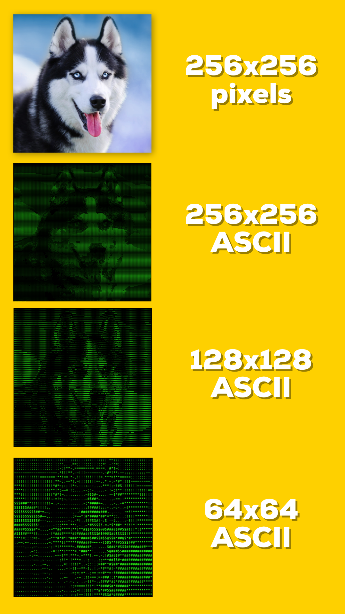

# Tuần 3: RIMG - Convert Image to Text program
Chương trình đơn giản lấy input là một file ảnh và chuyển đổi thành 1 ảnh vẽ bởi các kí tự ASCII lên màn hình console.
Do giới hạn về chiều rộng của màn hình console nên chương trình còn có chức năng thay đổi chiều rộng của ảnh sinh ra.

Hình vẽ được sinh ra bởi chương trình:

